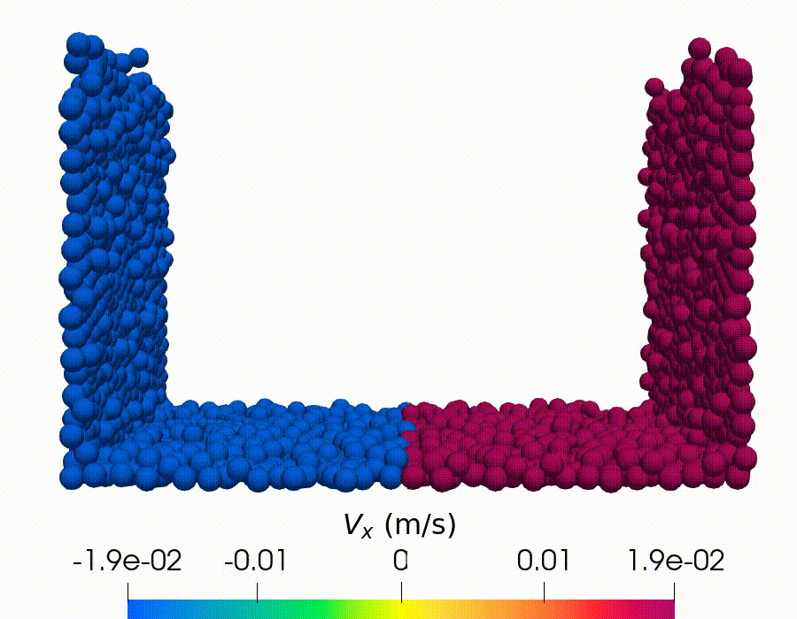

## Key insight

Sheared granular materials behave fundamentally differently depending on particle shape:

- **Spherical particles** → no surface deformation  
- **Elongated particles** → develop a pronounced surface depression  

This transition is governed by a competition between:

- **Alignment-driven compaction** (dominant at low friction)  
- **Friction-driven dilatancy** (dominant at high friction)  

Using DEM simulations, I show how these microscopic mechanisms directly control **shear-band structure** and **free-surface morphology**.

---

## System (visual)

{width=220 style="display:block; margin:auto;"}

Linear split-bottom shear cell with elongated particles (DEM simulation).  
<a href="../videos.html">See full simulations →</a>

This work is published in *Physical Review Fluids* (2026), [DOI](https://doi.org/10.1103/z1rz-b4j6).

---

## What I did

- Built DEM simulations of **spheres and elongated particles** (AR = 1–5) in a linear split-bottom shear cell  
- Computed continuum fields (density, velocity, stress tensor) using coarse-graining  
- Quantified particle alignment inside the shear band using orientation statistics and nematic order parameter **S**  
- Systematically varied friction (µ = 0.01–0.8) to isolate its effect on alignment, stress, and surface morphology  

---

## Methods & tools

- **Simulation:** MercuryDPM (multisphere particles, Hertz–Mindlin contact model).
- **Geometry:** linear split-bottom shear cell with periodic boundary conditions in the flow direction.
- **Particles:** spheres (AR = 1) and stick-shaped grains built from connected spheres (AR = 2–5).
- **Parameter range:** friction coefficient µ = 0.01–0.8; aspect ratio AR = 1–5.
- **Post-processing:** coarse-graining via `MercuryCG`, analysis and plotting in Python / MATLAB.

---

## Key results

### 1. Shape controls surface morphology

- **Spheres (AR = 1)** → flat surface  
- **Elongated particles (AR > 1)** → clear surface depression  

This shows that particle geometry alone can fundamentally change macroscopic behavior.

---

### 2. Friction weakens alignment

- Strong alignment at low friction → **S ≈ 0.8**
- Reduced alignment at high friction → **S ≈ 0.4**

Higher friction disrupts particle ordering inside the shear band.

---

### 3. Competing mechanisms inside the shear band

Two mechanisms control the system:

- **Alignment → compaction (density increases)**
- **Dilatancy → expansion (density decreases)**

- Low friction → alignment dominates → broader depression  
- High friction → dilatancy dominates → localized deformation  

---

### 4. Key physical insight

Surface morphology is not random — it directly emerges from:

- particle shape  
- friction  
- shear-induced alignment  

This links **microscopic particle physics → macroscopic flow behavior**.  

---

## Takeaway

Particle shape and friction do not just modify granular flow —  
they fundamentally determine how shear is localized and how the free surface evolves.

This work shows how **microscopic alignment mechanisms translate into macroscopic morphology**.

---

## Media

- ▶️ Simulation video: [Watch on the Videos page](../videos.qmd)

## Publication

H. Rahim, S. Roy, and T. Pöschel  
*Impact of friction and grain shape on the morphology of sheared granular media*  
**Physical Review Fluids (2026)**  
[DOI](https://doi.org/10.1103/z1rz-b4j6)